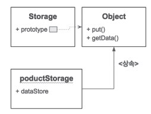
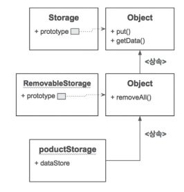

# 047 화살표 함수 이해하기

ES6에서는 기존 함수를 간결하게 표현할 수 있고 기능이 갯너된 화살표 함수가 추가되었습니다.

<strong>function키워드를 사용하지 않고 화살표 모양의 => 연산자를 이용</strong>

<strong>규칙</strong>

* 매개변수가 하나인 경우 인자를 정의할 때 괄호를 생략할 수 있다.

* 매개변수가 없거나 둘 이상일 경우 괄호를 작성해야 한다.

* 화살표 함수 코드 블록을 지정하지 않고 한 문장으로 작성 시 return문을 사용하지 않아도

  <strong>화살표 오른쪽 표현식의 계산 결과값이 반환</strong>됩니다.

* 화살표 함수 코드 블록을 지정한 경우 반환하고자 하는 값에 return문을 작성해야 합니다.

  <strong>return문이 없으면 undefined가 반환</strong>

```javascript
// x를 전달 받아 x + x결과를 반환.
const double = x => x + x;
console.log(double(2));

// a와 b를 받아 a+b를 리턴
const add = (a, b) => a + b;
console.log(add(1, 2));

// 아무런 매개변수를 정의하지 않았기 때문에 괄호로 빈 매개변수 표현.
// arguments 객체를 콘솔에 출력. return이 없기 때문에 반환값은 없음.
const printArguments = () => {
    console.log(arguments);
}

// 1,2,3을 전달하면서 정의된 화살표 함수를 호출하지만, Uncaught Reference에러가 발생.
// 화살표함수는 기본함수와 다르게 argument객체가 만들어지지 않는다.
printArguments(1, 2, 3);

// args는 전달받은 인자목록을 배열로 사용할 수 있다.
// 코드블록에 대괄호를 썻기 때문에 return문을 작성해 반환값 명시
const sum = (...args) => {
    let total = 0;
    for (let i = 0; i < args.length; i++) {
        total += args[i];
    }
    return total;
}
console.log(sum(1, 2, 3));

// 화살표함수도 함수의 인자로 전달이 가능.
// setTimeout함수의 인자로 화살표 함수가 전달되고, 이때 매개변수가 없어 괄호를 작성해줌.
setTimeout(() => {
    console.log('화살표 함수!');
}, 10);
```


# 048 자바스크립트 객체지향 프로그래밍 이해하기

### 객체지향 프로그래밍

프로그램을 객체들로 구성하고 객체들 간에 서로 상호작용하도록 작성하는 방법

객체는 <strong>특징적인 행동</strong>과 <strong>변경 가능한 상태</strong>을 가집니다.

```javascript
 // Jay선생을 객체로 표현
const teacherJay = {
    name: '제이',
    age: 30,
    // 객체를 사용
    teachJavascript: function (student) { // 학생을 매개변수로 정의함.
        student.gainExp();
    }
}

// 뽀 학생을 객체로 표현
const studentBbo = {
    name: '뽀',
    age: 20,
    exp: 0,
    gainExp: function () {
        this.exp++;
    }
}

console.log(studentBbo.exp); // 0
teacherJay.teachJavascript(studentBbo);
console.log(studnetBbo.exp); // 1
```

* 무수히 많은 객체들을 공통적인 특성을 기준으로 객체를 묶어서 하나의 타입으로 정의하는 것을 <strong>분류(classification)</strong>라고 하며, 일종의 추상화를 하는것임.
* 자바스크립트는 프로토타입 기반으로 객체지향 프로그래밍을 지원합니다.
* 자바의 클래스와는 큰 차이점으로 <strong>프로토타입</strong>으로 객체에 공통사항을 적용할 수 있습니다.
* 모든 객체는 다른 객체의 <strong>원형(Prototype)</strong>이 될 수 있습니다.

```javascript
// Jay선생을 객체로 표현
const teacherJay = {
    name: '제이',
    age: 30,
    // 객체를 사용
    teachJavascript: function (student) { // 학생을 매개변수로 정의함.
        student.gainExp();
    }
}

// 뽀 학생을 객체로 표현
const studentBbo = {
    name: '뽀',
    age: 20,
    exp: 0,
    gainExp: function () {
        this.exp++;
    }
}

console.log(studentBbo.exp); // 0
teacherJay.teachJavascript(studentBbo);
console.log(studnetBbo.exp); // 1

/************************************************* */
// 학생의 경험치를 얻는 행위를 gainExp메소드로 작성한 원형(prototype)객체를 정의
const studentProto = {
    gainExp: function () {
        this.exp++;
    }
}

// __proto__속성에 원형 객체를 정의할 수 있습니다.
// 별도로 __proto__속성에 다른 객체를 할당하지 않으면 기본적으로 Object.prototype객체가 연결됨.
const harin = {
    name: '하린',
    age: 10,
    exp: 0,
    __proto__: studentProto
};

const bbo = {
    name: "뽀",
    age: 20,
    exp: 10,
    __proto__: studentProto
};

bbo.gainExp();
harin.gainExp();
harin.gainExp();
console.log(harin); // { name: '하린', age: 10, exo: 2}
console.log(bbo); // { name: '뽀', age: 10, exo: 11}
```

* <strong>'___________proto___'</strong>속성에 원형 객체를 정의할 수 있습니다.
* 별도로'___________proto___'속성에 다른 객체를 할당하지 않으면, 기본적으로 Object.prototype객첼가 연결됩니다.


# 049 생성자 함수 이해하기

자바스크립트 함수는 재사용 가능한 코드의 묶음으로 사용하는 것 외에 객체를 생성하기 위한 방법으로도 사용함.

객체 생성을 위해 직접적으로 객체를 반환해도 되지만, new 키워드를 사용하여 함수를 호출하면 return문 없어도 새 객체가 반환된다.

this키워드를 사용하여 반환되는 객체의 초기 상태와 행위를 정의할 수 있음.


* 이렇게 객체를 생성하는 역할을 하는 함수를 생성자 함수라고 하는데 <strong>생성자 함수 </strong>는 new 키워드를 사용하지 않으면 일반적인 함수와 동일하게 동작하여 새로은 객체를 반환하지 않습니다.
* 함수명을 대문자로 시작하는 관례를 가짐.

```
객체에 타입이 적용되면 해당 객체는 그 타입의 인스턴스라고 부릅니다.
new키워드로 만들어진 객체는 해당 타입의 인스턴스가 됩니다.
```

```javascript
// Teacher생성자 함수를 정의함.
// 전달받은 매개변수들의 값을 this를 사용해 대입함.
function Teacher(name, age, subject) {
    this.name = name;
    this.age = age;
    this.subject = subject;
    this.teach = function (student) {
        console.log(student + '에게' + this.subject + '를 가르칩니다.');
    };
}
// new키워드와 함께 생성자 함수를 호출하면 생성자 함수 블록이 실행되고 별도의 return문이 없어도 새로운 객체가 반환됨.
// 이때 반환되는 새로운 객체를 가리키는 것이 this
const jay = new Teacher('jay', 30, 'JavaScript');
console.log(jay); // Teacher타입의 객체를 출력.
jay.teach('bbo'); // 해당 객체의 teach메소드를 호출

// 모든 객체는 constructor속성을 가집니다.
// 이때 생성자 함수의 this는 전역 객체를 가리키게 됩니다.
console.log(jay.constructor); // jay객체의 constructor속성은 Teachr 생성자 함수를 가리킴.
console.log(jay instanceof Teacher); // jay객체가 Teacher생성자 함수의 인스턴스 여부를 확인.

// new를 빼고 Teacher생성자함수를 호출.
// 이 때 생성자함수의 this는 전역객체를 가리킴.
const jay2 = Teacher('jay', 30, 'Javascript');
console.log(jay2); // 새로운 객체가 반환되지 않아 jay2는 undefined
console.log(age); // 전역변수의 age
```

### 생성자 함수의 new호출을 통한 객체 생성 과정

```
1. 빈 객체를 만듭니다.
2. 만든 빈 객체를 this에 할당
3. 생성자 함수 바디의 코드를 실행합니다. ( this에 속성 및 메소드 추가 )
4. 만든 빈 객체의 __proto__에 생성자 함수의 prototype속성을 대입
5. this를 생성자의 반환값으로 변환
```


# 050 프로토타입 기반 상속 이해하기

자바스크립트에서 생성자 함수로부터 만들어진 객체는 그 생성자 함수의 프로토타입(Prototype)객체를 상속함.

<strong>즉,  모든 인스턴스는 해당 생성자 함수의 프로토타입 객체의 속성과 메소드들을 사용할 수 있다.</strong>


자바스크립트에서 모든 함수는 prototype속성으로 프로토타입 객체를 가짐.

모든 객체는 ____________proto____________속성을 가지는데, <strong>____________proto____________속성은 해당 객체를 생성한 생성자 함수의 prototype 객체를 가리킵니다.</strong>

=> 그래서 <strong>생성자 함수를 통해서 타입을 정의 할 수 있다.</strong>

```javascript
function Storage() {
    // 내부속성으로 dataSource를 가지고 빈객체를 할당
    this.dataStore = {};
}

Storage.prototype.put = function (key, data) {
    // 주어진 키에 dataSource속성을 할당.
    this.dataStore[key] = data;
}

Storage.prototype.getData = function (key) {
    // 매개변수의 값을 키로 해서 dataStore 속성에서 찾아 반환
    return this.dataStore[key];
}

// Storage타입의 인스턴스를 생성하면 인스턴스는 해당 생성자 함수의 프로토타입을 상속함.
// Storage 생성자 함수의 프로토타입에 정의된 메소드들을 해당 인스턴스들은 사용가능.
const productStorage = new Storage();
productStorage.put('1d001', { name: '키보드', price: 2000 });
console.log(productStorage.getData('1d001'));


// RemoveableStorage생성자 함수를 정의
// storage함수를 호출하면서 this를 전달하는데
// => Storage생성자 함수가 호출되면서 RemoveableStorage 생성자 함수의 this에 Storage함수에서 정의한대로 dataStore가 속성으로 추가됨.
function RemovableStorage() {
    Storage.call(this);
}


// Object.create메소드는 주어진 인자를 __proto__에 연결한 새로운 객체를 반환함.
// RemovableStorag.prototype에 Object.create(Storage.prototype)를 할당하면 Storage함수의 프로토타입 객체가 RemovableStorage함수의 프로토타입 객체의 __proto__에 할당됨.
// 두 프로토타입이 상속관계를 형성.
// RemoveableStorage생성자 함수의 프로토타입 객체에 removeAll메소드를 추가함.
RemovableStorage.prototype = Object.create(Storage.prototype);

RemovableStorage.prototype.removeAll = function () {
    this.dataStore = {}
}

// RemovableStorage 생성자 함수에 의해 만들어진 인스턴스들은 내부에 없는 메소드를 Removable 생성자 함수의 프로토타입에서 먼저찾고,
// 없으면 Storage ㅅ애성자 함수의 프로토타입에서 찾게됨.
// 나아가 Object.prototype에서까지 찾게됨.

// 이렇게 프로토타입 객체가 서로 연결되어 있다하여 프로토타입 체인이라고도 합니다.
const productStorage2 = new RemovableStorage();
productStorage2.put('id001', { name: '키보드', price: 2000 });
productStorage2.removeAll();

const item2 = productStorage2.getData('id001');
console.log(item2);
```

<strong>Storage생성자 함수의 프로토타입과 인스턴스의 상속관계.</strong>



* Storage타입의 인스턴스를 생성하면 인스턴스는 해당 생성자 함수의 프로토타입을 상속함.
* Storage 생성자 함수의 프로토타입에 정의된 메소드들을 해당 인스턴스들은 사용가능.


<strong>각 생성자 함수의 프로토타입이 연결된 형태</strong>



*  storage함수를 호출하면서 this를 전달하는데

  => Storage생성자 함수가 호출되면서 RemoveableStorage 생성자 함수의 this에 Storage함수에서 정의한대로 dataStore가 속성으로 추가됨.

* Object.create메소드는 주어진 인자를 _________proto _________에 연결한 새로운 객체를 반환함.

* RemovableStorag.prototype에 Object.create(Storage.prototype)를 할당하면 Storage함수의 프로토타입 객체가 RemovableStorage함수의 프로토타입 객체의 _________proto _________에 할당됨.

* <strong>두 프로토타입이 상속관계를 형성</strong>

* RemovableStorage 생성자 함수에 의해 만들어진 인스턴스들은 내부에 없는 메소드를 <strong>Removable 생성자 함수의 프로토타입에서 먼저찾고,</strong>

* <strong>없으면 Storage 생성자 함수의 프로토타입에서 찾게됨.</strong>

* <strong>나아가 Object.prototype에서까지 찾게됨.</strong>

* 이렇게 프로토타입 객체가 서로 연결되어 있다하여 <strong>프로토타입 체인</strong>이라고도 합니다.

